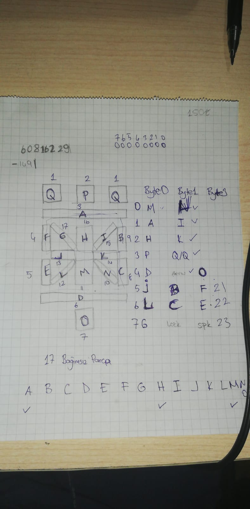
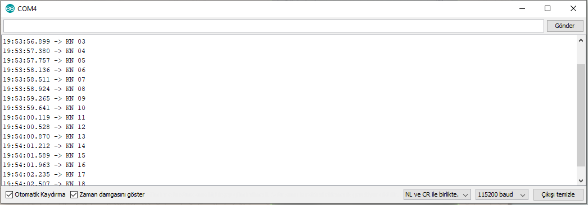

Aselsan LCD Segment yapısı ve Segment Mapleme Konusunda çalışma karalamaları eklendi.

Aselsan MCU'dan gelen veriyi decode edip USB seri port aracılığı ile PC'ye gönderen arduino kodu eklendi. (Şimdilik sadece rakamları ve K ve KN harflerini tanıyabiliyor)

